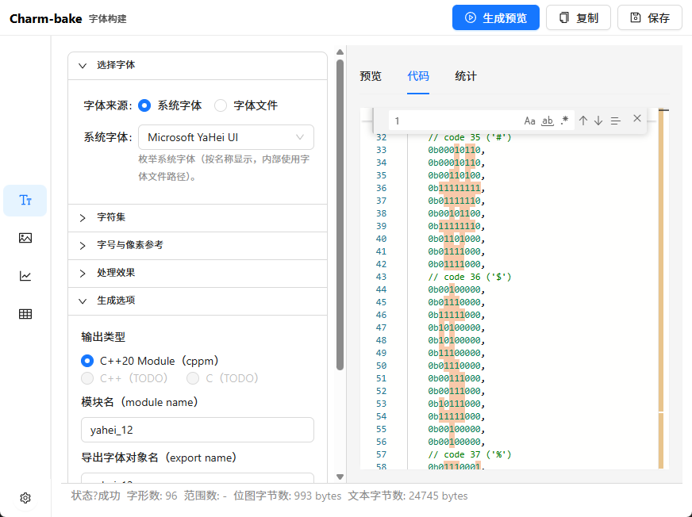
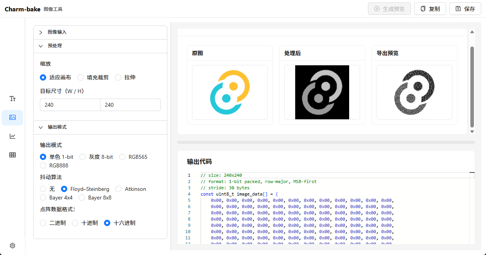
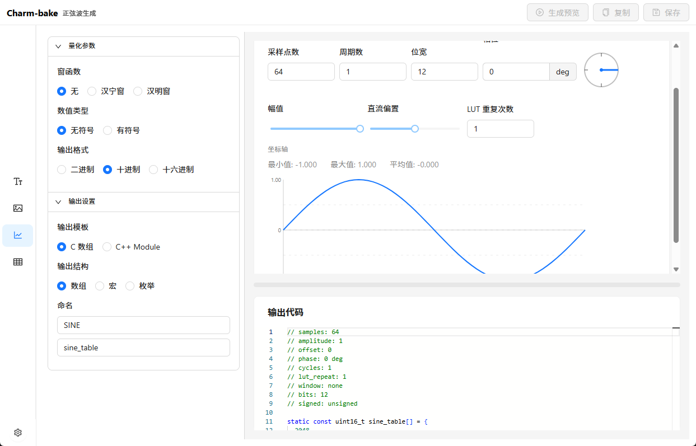
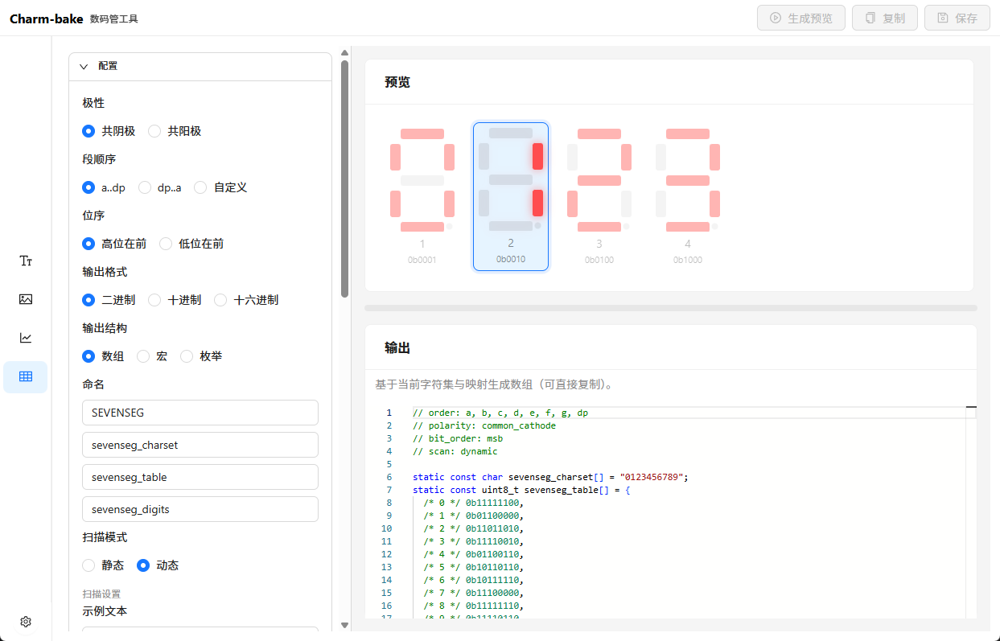

<div align="center">

# [Charm-bake](https://github.com/Little-Red-Cap/Charm-bake)

**Bake fonts & images into MCU-friendly C/C++ data.**
<br>
**生成 MCU 友好的 C/C++ 字体与图像数据**

[](../LICENSE)
[](https://github.com/Little-Red-Cap/Charm-bake/actions)

</div>

[English](README_en.md) | [简体中文](../README.md)

---

<div align="center">

Issues: [GitHub Issues](https://github.com/Little-Red-Cap/Charm-bake/issues)

</div>

## ✨ Highlights

- One-click baking: convert fonts/images into MCU-ready data
- Tauri + React + Rust, cross-platform desktop workflow
- Rich previews: grayscale/mono/export consistency, waveform and 7-seg visualization
- Embedded-first: bit order, scan direction, and output formats are extensible

## 📸 Screenshots

> Placeholders for screenshots. Replace with real images later.






## 🚀 Features

### Font Builder
- System font / file font loading
- Charset range + custom chars + fallback
- Gray/mono preview aligned with export
- C++20 module output (cppm)

### Image Tools
- Image loading and resize modes
- Mono / Gray / RGB565 / RGB888 outputs
- Dithering (Floyd / Atkinson / Bayer)
- Code preview and one-click save

### Sine Generator
- Interactive waveform preview
- Quantization bits, output format, templates

### Seven-Seg Tools
- Common anode/cathode, segment/bit order
- Dynamic scan & digit select config
- Output code preview

## 🧱 Tech Stack

- **Frontend**: React, Ant Design, Vite
- **Desktop**: Tauri v2
- **Backend**: Rust
- **Preview**: Monaco Editor

## 🗂️ Project Structure

```
src/
  app/                App entry and layout
  components/         UI components (Font/Image/Sine/SevenSeg)
    common/           Shared components (SplitPane, CodeEditor)
  domain/             Domain logic (i18n, format, validate)
  services/           Frontend services (generator, saveTextFile)
  store/              Zustand state
src-tauri/
  src/                Rust backend (font_pipeline, settings, ...)
```

## 🧪 Dev & Build

```bash
npm install
npm run dev
```

Tauri build:
```bash
npm run build
cargo tauri build
```

## 🧭 Roadmap

- Complete image export parameters (bit order / scan direction / thresholds / matrix size)
- Unified export templates and documentation
- More MCU-friendly output formats

## 🤝 Contributing

PRs and Issues are welcome. Let’s make Charm-bake a practical embedded asset baker.
